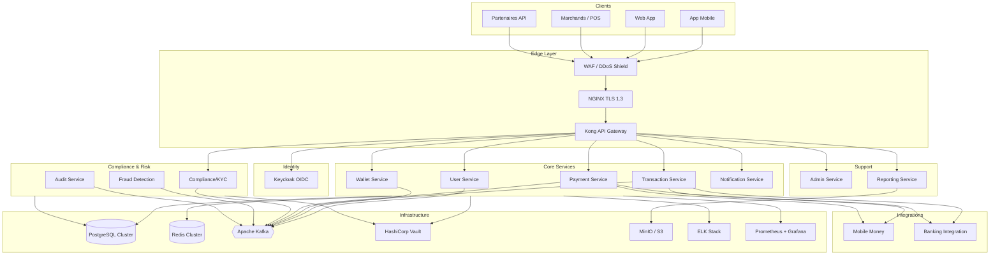
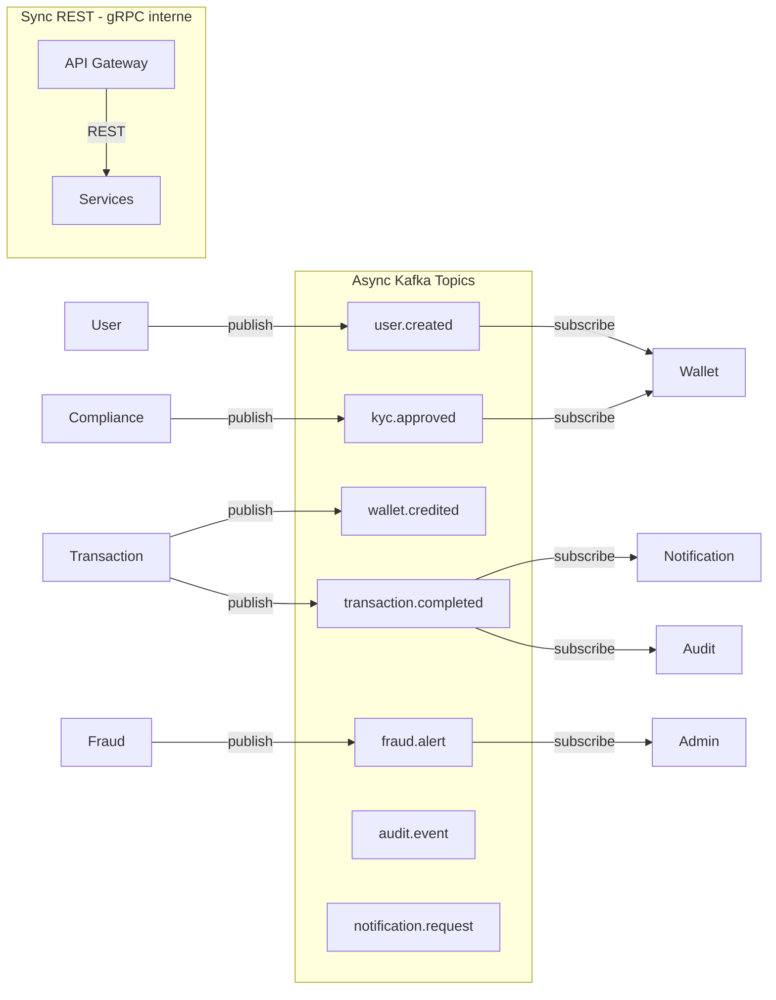
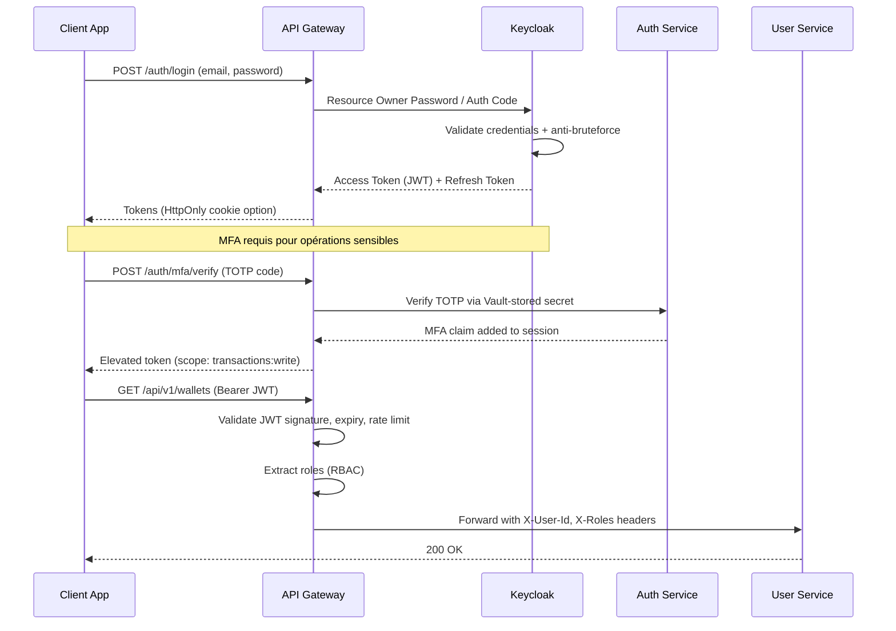
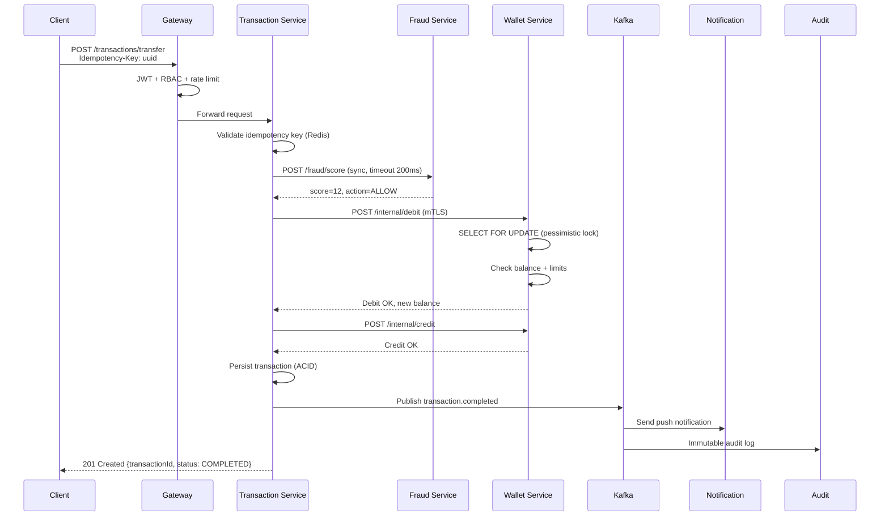

# Architecture globale — VillageSat Fintech

## 1. Vue d'ensemble

VillageSat adopte une **architecture microservices event-driven** avec séparation stricte des domaines métier (Domain-Driven Design). Chaque service possède sa propre base de données (pattern Database-per-Service) avec synchronisation via événements Kafka.

### Diagramme haut niveau



## 2. Architecture hexagonale (par service)

Chaque microservice suit le pattern **Ports & Adapters** :

```
services/wallet-service/
├── domain/           # Entités, value objects, règles métier pures
│   ├── model/
│   ├── port/in/      # Use cases (interfaces)
│   └── port/out/     # Repositories, messaging (interfaces)
├── application/      # Services applicatifs, orchestration
│   └── service/
├── adapter/
│   ├── in/web/       # REST controllers, WebSocket
│   ├── in/messaging/ # Kafka consumers
│   └── out/
│       ├── persistence/  # JPA repositories
│       ├── messaging/    # Kafka producers
│       └── external/     # Clients HTTP partenaires
└── config/           # Spring configuration, sécurité
```

**Règle d'or** : le domaine ne dépend d'aucun framework. Les adapters implémentent les ports.

## 3. Diagramme des microservices et communication



### Topics Kafka principaux

| Topic | Producteur | Consommateurs | Rétention |
|-------|-----------|---------------|-----------|
| `user.events` | user-service | wallet, compliance, audit | 90j |
| `kyc.events` | compliance-service | wallet, transaction, admin | 7 ans |
| `wallet.events` | wallet-service | transaction, reporting, audit | 7 ans |
| `transaction.events` | transaction-service | payment, fraud, notification, audit | 7 ans |
| `payment.events` | payment-service | transaction, reporting | 7 ans |
| `fraud.alerts` | fraud-service | admin, compliance, notification | 7 ans |
| `audit.events` | all services | audit-service | 10 ans |

## 4. Flux d'authentification (OAuth2 + OIDC + MFA)



### RBAC — Rôles et permissions

| Rôle | Permissions |
|------|-------------|
| `CUSTOMER` | wallet:read, transaction:read, transfer:own |
| `MERCHANT` | + payment:accept, qr:generate |
| `AGENT` | + cash:in/out (mobile money agent) |
| `COMPLIANCE_OFFICER` | kyc:review, aml:investigate |
| `FRAUD_ANALYST` | fraud:review, account:freeze |
| `ADMIN` | * (scoped par tenant) |
| `SUPER_ADMIN` | system:* |

Les permissions sont stockées dans Keycloak et propagées via JWT claims (`realm_access.roles`, `resource_access`).

## 5. Flux de transaction (transfert P2P)



### Garanties transactionnelles

- **Saga orchestrée** pour transferts cross-service avec compensation
- **Outbox pattern** : événements Kafka écrits dans la même transaction DB
- **Idempotency-Key** : header obligatoire, TTL Redis 24h
- **Double-entry ledger** : chaque mouvement = débit + crédit
- **Signature HMAC-SHA256** des transactions > seuil configurable

## 6. Zero Trust Architecture

```
┌─────────────────────────────────────────────────────────┐
│                    Service Mesh (Istio)                  │
│  ┌─────────┐  mTLS   ┌─────────┐  mTLS   ┌─────────┐   │
│  │ Service │◄──────►│ Service │◄──────►│ Service │   │
│  │    A    │         │    B    │         │    C    │   │
│  └─────────┘         └─────────┘         └─────────┘   │
│       ▲ Policy enforcement (OPA)                        │
└───────┼─────────────────────────────────────────────────┘
        │ JWT + mTLS
   ┌────┴────┐
   │ Gateway │
   └─────────┘
```

- **mTLS** entre tous les services (certificats Vault PKI)
- **Network Policies** Kubernetes : deny-all par défaut
- **OPA/Gatekeeper** : policies admission (no privileged containers)
- **Secrets** : jamais en env vars, toujours via Vault Agent Injector

## 7. Haute disponibilité

| Composant | Stratégie | SLA cible |
|-----------|-----------|-----------|
| API Gateway | 3+ replicas, HPA | 99.99% |
| Services core | 3+ replicas par AZ | 99.95% |
| PostgreSQL | Patroni HA, sync replica | 99.99% |
| Redis | Sentinel / Cluster mode | 99.9% |
| Kafka | 3 brokers, RF=3, min ISR=2 | 99.95% |
| Keycloak | 2+ replicas, sticky sessions | 99.9% |

**RPO** : 0 (sync replication) | **RTO** : < 15 minutes (failover automatique)

## 8. Multi-région Afrique

```
┌──────────────┐     ┌──────────────┐     ┌──────────────┐
│  af-south-1  │     │  eu-west-1   │     │  us-east-1   │
│  (Cape Town) │     │  (Dublin)    │     │  (Virginia)  │
│  PRIMARY CD  │     │  DR + EU     │     │  DR Global   │
└──────┬───────┘     └──────┬───────┘     └──────┬───────┘
       │                    │                    │
       └────────────────────┼────────────────────┘
                    Global Load Balancer
                    (GeoDNS + health checks)
```

Données utilisateurs africains hébergées en **af-south-1** (conformité souveraineté des données).

## 9. Références internes

- [Sécurité](security.md)
- [API Reference](api-reference.md)
- [Base de données](database.md)
- [DevSecOps](devsecops.md)
