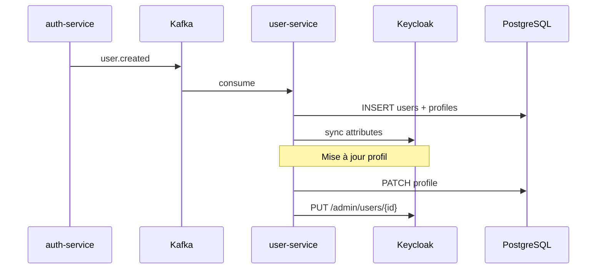

# User Service — VillageSat

Gestion des profils utilisateurs et synchronisation bidirectionnelle avec Keycloak.

## Fonctionnalités

- **Provisioning** automatique via Kafka (`user.created` depuis auth-service)
- **Profil** : GET/PATCH `/api/v1/users/me`
- **Export RGPD** : `GET /api/v1/users/me/data-export` (async, statut PENDING)
- **Sync Keycloak** : mise à jour firstName, lastName, attributs custom à chaque PATCH
- **KYC** : écoute `kyc.approved` → mise à jour niveau KYC local + Keycloak

## Endpoints

| Méthode | Path | Auth | Description |
|---------|------|------|-------------|
| GET | `/api/v1/users/me` | JWT | Profil complet |
| PATCH | `/api/v1/users/me` | JWT | Mise à jour profil + sync Keycloak |
| GET | `/api/v1/users/me/data-export` | JWT | Demande export RGPD |
| GET | `/internal/users/{userId}` | Service token | Lecture profil (inter-services) |
| POST | `/internal/users/provision` | Service token | Provisioning manuel |

## Flux de synchronisation



## Démarrage

```bash
docker compose up -d postgres kafka keycloak
cd services/user-service && mvn spring-boot:run
```

Port : **8082** | Swagger : http://localhost:8082/swagger-ui.html

## Événements Kafka consommés

| Topic | Event | Action |
|-------|-------|--------|
| `user.events` | `user.created` | Création user + profil |
| `kyc.events` | `kyc.approved` | Mise à jour kycLevel + statut ACTIVE |
